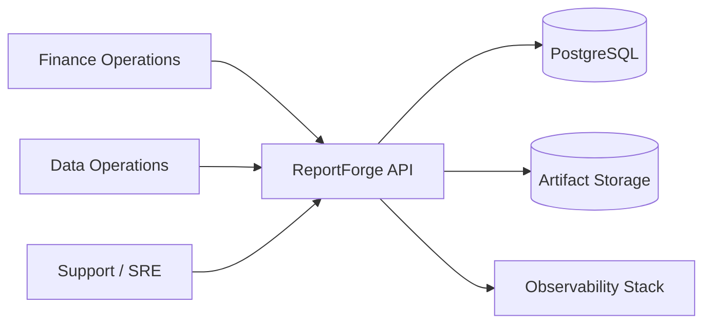

# C4 Context

## System Context

ReportForge is a backend reporting platform used by finance, data operations,
platform, and support users through HTTP clients. It accepts report requests,
runs asynchronous generation, stores artifacts, and exposes signed downloads.

## External Systems

- PostgreSQL stores tenant, report, event, artifact metadata, audit, and Oban
  state.
- Local or S3-compatible object storage stores generated artifact bytes.
- OpenTelemetry Collector, Prometheus, and Grafana receive operational signals
  in the production-like Compose stack.

## Trust Boundaries

- Public HTTP clients cross into authenticated API routes.
- Signed download URLs temporarily expose artifact access outside API-key auth.
- Workers execute asynchronously after the original request completes.
- Storage backends are treated as infrastructure dependencies, not business
  authority.
