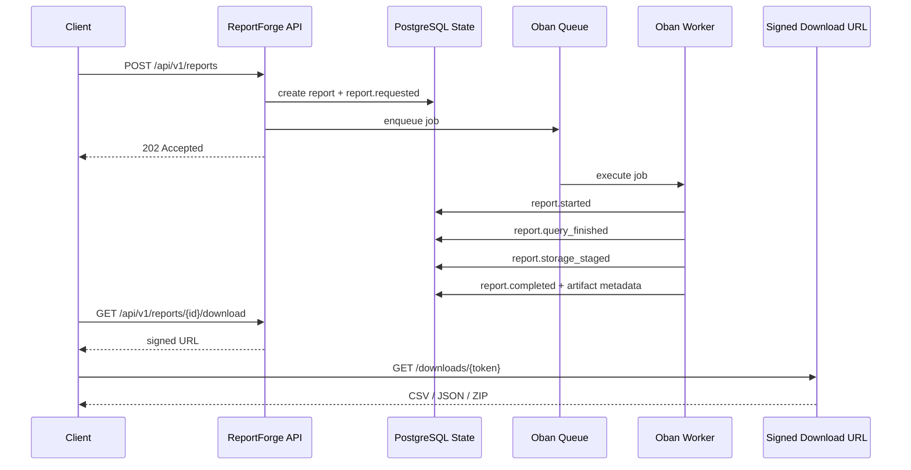

# Report Lifecycle Sequence

```mermaid
sequenceDiagram
  participant Client
  participant API as ReportForge API
  participant DB as PostgreSQL State
  participant Queue as Oban Queue
  participant Worker as Oban Worker
  participant Download as Signed Download URL

  Client->>API: POST /api/v1/reports
  API->>DB: create report + report.requested
  API->>Queue: enqueue job
  API-->>Client: 202 Accepted
  Queue->>Worker: execute job
  Worker->>DB: report.started
  Worker->>DB: report.query_finished
  Worker->>DB: report.storage_staged
  Worker->>DB: report.completed + artifact metadata
  Client->>API: GET /api/v1/reports/{id}/download
  API-->>Client: signed URL
  Client->>Download: GET /downloads/{token}
  Download-->>Client: CSV / JSON / ZIP
```
