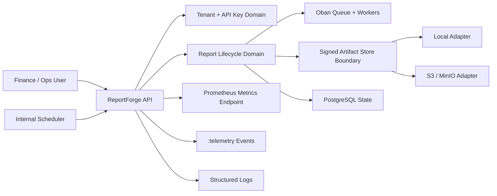

# System Context

```mermaid
flowchart LR
  Ops["Finance / Ops User"] --> API["ReportForge API"]
  Scheduler["Internal Scheduler"] --> API
  API --> Identity["Tenant + API Key Domain"]
  API --> Reports["Report Lifecycle Domain"]
  Reports --> Jobs["Oban Queue + Workers"]
  Reports --> Artifacts["Signed Artifact Store Boundary"]
  Artifacts --> LocalStore["Local Adapter"]
  Artifacts --> S3Store["S3 / MinIO Adapter"]
  Reports --> DB["PostgreSQL State"]
  API --> Metrics["Prometheus Metrics Endpoint"]
  API --> Telemetry[":telemetry Events"]
  API --> Logs["Structured Logs"]
```
