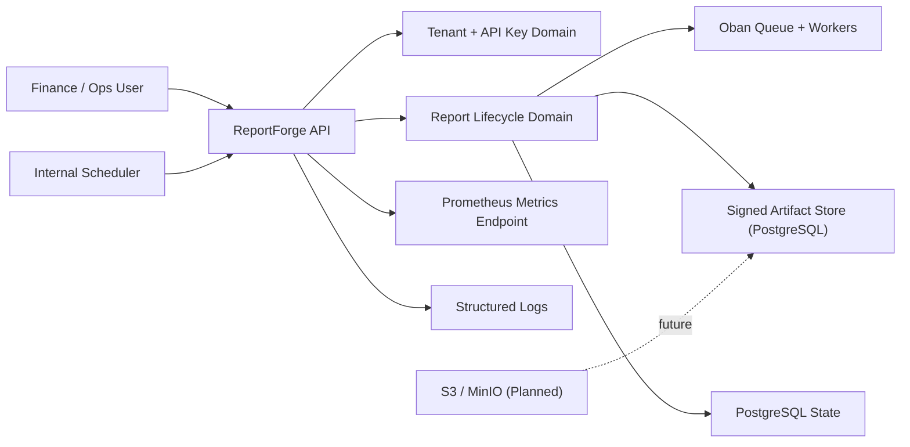

# System Context

```mermaid
flowchart LR
  Ops["Finance / Ops User"] --> API["ReportForge API"]
  Scheduler["Internal Scheduler"] --> API
  API --> Identity["Tenant + API Key Domain"]
  API --> Reports["Report Lifecycle Domain"]
  Reports --> Jobs["Oban Queue + Workers"]
  Reports --> Artifacts["Signed Artifact Store (PostgreSQL)"]
  Reports --> DB["PostgreSQL State"]
  API --> Metrics["Prometheus Metrics Endpoint"]
  API --> Logs["Structured Logs"]
  FutureStorage["S3 / MinIO (Planned)"] -. future .-> Artifacts
```
